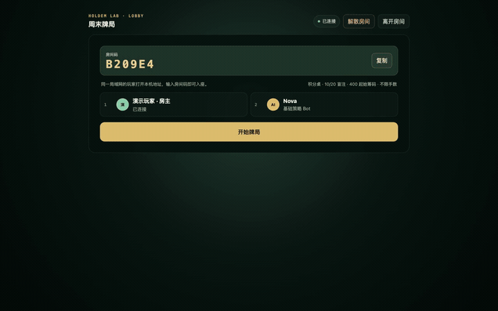
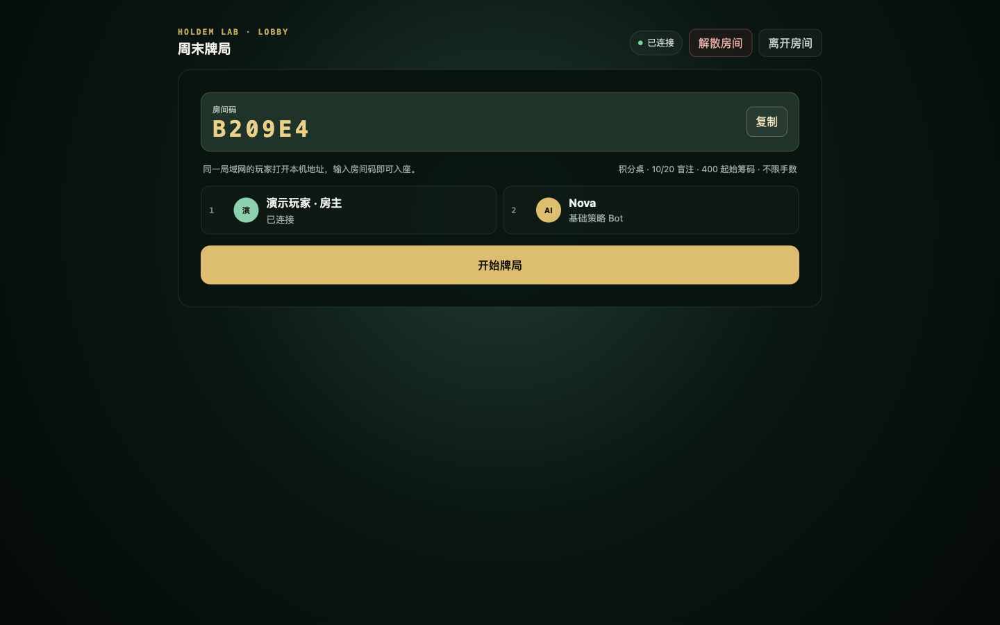
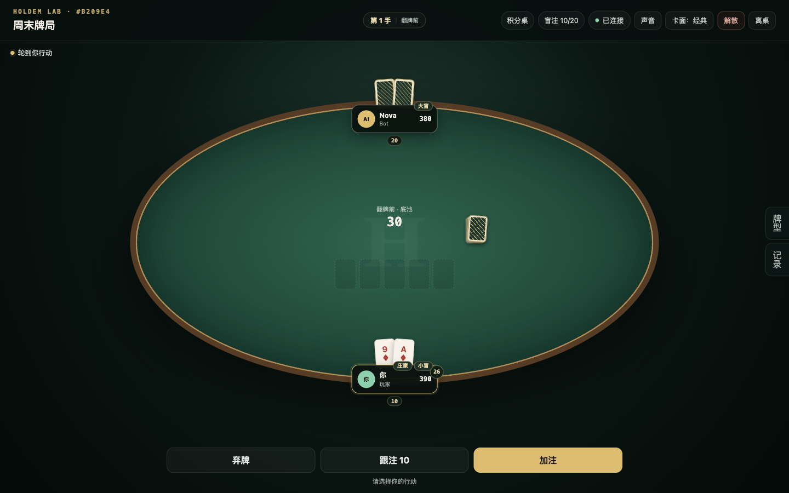
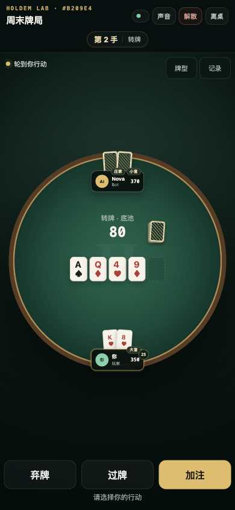
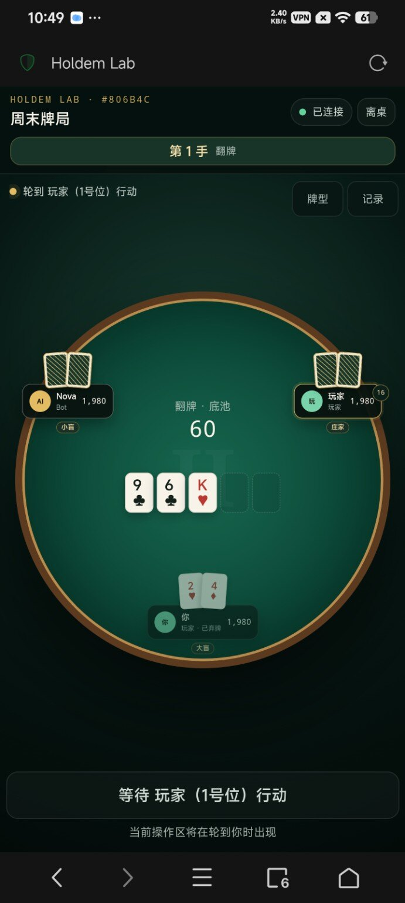
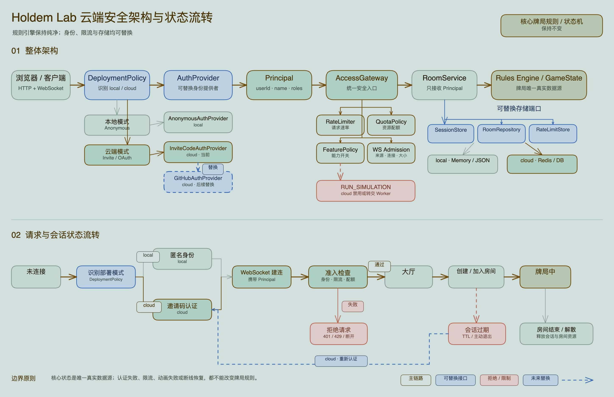

# Holdem Lab

一套可在电脑或 Android 手机上运行的局域网 Web 德州扑克。牌局由服务端统一判定，支持真人与 Bot 混桌、断线恢复、观战、补充筹码、结算排名和确定性回放。

[](docs/assets/gameplay-demo.mp4)

> 点击动图查看 8 秒 MP4 演示。演示内容来自本项目实际页面。

## 界面预览

### 创建房间



### 桌面与手机牌桌

<p align="center">
  
  
</p>

## 电脑快速启动

需要 [Git](https://git-scm.com/) 和 Node.js `20.19+` 或 `22.12+`。

```bash
git clone https://github.com/YZGUS/holdem-lab.git
cd holdem-lab
npm ci
npm run dev
```

浏览器打开 [http://127.0.0.1:5173](http://127.0.0.1:5173)。此模式会同时启动：

- Web 开发服务：`0.0.0.0:5173`
- 牌局与 WebSocket 服务：`0.0.0.0:8787`

### 邀请同一局域网的玩家

1. 运行服务的电脑与其他玩家连接同一个 Wi-Fi。
2. macOS 可用下面的命令查看 Wi-Fi 地址：

   ```bash
   ipconfig getifaddr en0
   ```

3. 其他玩家访问 `http://<电脑局域网 IP>:5173`。
4. 房主创建房间并分享 6 位房间码，其他玩家输入房间码加入。

## Android 手机开桌

这个方案适合聚会或户外没有电脑时使用：一台 Android 手机运行 Node.js 服务，自己和其他玩家都用浏览器进入。实机流程已经跑通，不需要 Root，也不依赖云服务器。



### 为什么使用 Termux

Holdem Lab 需要真实的 HTTP 和 WebSocket 服务。Termux 能在 Android 上直接运行 Node.js，并监听局域网端口；普通浏览器里的在线开发环境通常不能让附近设备直接连接手机上的端口。

建议从 [F-Droid](https://f-droid.org/packages/com.termux/) 安装 Termux，也可以使用 [Termux 官方 GitHub Release](https://github.com/termux/termux-app/releases)。Termux 与 Termux 插件应始终从同一个来源安装。

### 第一次安装

打开 Termux，依次执行：

```bash
pkg update -y && pkg upgrade -y
pkg install -y nodejs-lts git net-tools

node -v
npm -v
git --version

cd ~
git clone https://github.com/YZGUS/holdem-lab.git
cd ~/holdem-lab

npm ci
npm exec --workspace=@holdem/web -- vite build

termux-wake-lock
PORT=8787 npm start
```

看到下面的提示即表示服务启动成功：

```text
Holdem server listening on http://0.0.0.0:8787
```

当前手机打开：

```text
http://127.0.0.1:8787
```

同一 Wi-Fi 下的其他设备打开：

```text
http://<这台手机的局域网 IP>:8787
```

生产模式只使用 `8787`：网页、WebSocket 和健康检查均由同一个服务提供。

### 查看手机 IP

优先执行：

```bash
ifconfig wlan0
```

找到类似 `inet 192.168.1.23` 的地址。如果没有 `wlan0`，执行 `ifconfig` 查看全部网卡，或前往 Android 的“设置 → Wi-Fi → 当前网络”查看 IP。

部分 Android 版本执行 `ip -4 addr show wlan0` 会出现 `Cannot bind netlink socket: Permission denied`。这是 Android 对网络接口信息的权限限制，不代表服务启动失败，改用 `ifconfig` 或系统设置即可。

### 以后每次启动

```bash
cd ~/holdem-lab
termux-wake-lock
PORT=8787 npm start
```

停止服务时按 `Ctrl + C`，随后执行：

```bash
termux-wake-unlock
```

### 更新手机上的代码

先按 `Ctrl + C` 停止服务，然后执行：

```bash
cd ~/holdem-lab
git status --short
git pull --ff-only
npm ci
npm exec --workspace=@holdem/web -- vite build
PORT=8787 npm start
```

如果 `git status --short` 显示本地改动，先处理这些改动，不要直接覆盖。

### Android 构建说明

手机上不要直接运行根目录的 `npm run build`。该命令会调用 TypeScript 7 的 `tsc`，其可执行文件在 Android/Termux 上可能不兼容。已验证的手机流程只用 Vite 构建 Web，再由 `tsx` 启动服务：

```bash
npm exec --workspace=@holdem/web -- vite build
PORT=8787 npm start
```

为避免 Android 在牌局中暂停 Termux，建议关闭 Termux 的电池优化，并在开桌前使用 `termux-wake-lock`。手机热点能否允许其他设备反向访问宿主端口取决于系统和厂商设置；稳定使用时优先让所有设备连接同一个 Wi-Fi。

## 生产运行

电脑或服务器可使用完整构建：

```bash
npm ci
npm run build
PORT=8787 npm start
```

访问 `http://<服务器地址>:8787`。如使用反向代理，需要同时转发 HTTP 和 `/ws` WebSocket。

健康检查：

```bash
curl http://127.0.0.1:8787/health
```

正常响应示例：

```json
{"ok":true,"rooms":0,"mode":"local"}
```

### 云端受邀模式

公网部署时启用 `cloud` 模式。玩家必须先输入邀请码，服务端随后通过 HttpOnly Cookie 维持登录；房间配额绑定稳定用户身份，清除或更换浏览器 Session 也不会重置配额。

```bash
HOLDEM_DEPLOYMENT_MODE=cloud \
HOLDEM_INVITE_CODES='Alice:请替换为高强度邀请码,Bob:请替换为另一个邀请码' \
HOLDEM_ALLOWED_ORIGINS='https://cards.example.com' \
HOLDEM_COOKIE_SECURE=true \
PORT=8787 \
npm start
```

`HOLDEM_INVITE_CODES` 使用“显示名:邀请码”，多名玩家以逗号分隔。公网正式环境应通过 HTTPS 反向代理访问，并让 `HOLDEM_ALLOWED_ORIGINS` 与实际网页来源完全一致。

## 常见问题

### 页面能打开，但按钮没有反应

这通常表示 WebSocket 没有连接成功。

- 开发模式：确认 `npm run dev` 启动的 `5173` 和 `8787` 两个进程都在运行。
- 生产或 Android 模式：始终访问 `http://<主机 IP>:8787`，不要混用旧的 `5173` 地址。
- 确认系统防火墙允许 Node.js，并检查 Wi-Fi 是否启用了客户端隔离。
- VPN、代理或 Clash TUN 可能改变局域网路由。遇到连接失败时可临时关闭后重试，或为局域网网段设置直连。

### Termux 提示找不到 `package.json`

先进入仓库目录：

```bash
cd ~/holdem-lab
PORT=8787 npm start
```

### 如何加入牌局

1. 一名玩家创建房间。
2. 分享页面上的 6 位房间码和访问地址。
3. 其他玩家打开同一个地址，在大厅输入房间码。
4. 房主确认成员后开始牌局。

## 已实现功能

- 2–8 人无限注德州扑克，包含完整街道、最小加注、短筹码 All-in、主池、多层边池、平分底池和奇数筹码分配。
- 积分桌与淘汰赛，可设置起始筹码、大小盲、限定手数和补充筹码规则。
- Human + Bot 混合牌桌，当前提供基础策略 Bot。
- 刷新与断线恢复、主动离桌、重新入桌、观战、房主解散房间。
- 筹码用完后留桌观战，积分桌可申请补充并从下一手加入。
- 整局结算、最终排名、本手记录、逐动作回放与 JSON 导出。
- 错峰发牌、3D 翻牌、筹码移动、胜利效果、SFX 与 BGM。
- 桌面、窄屏和手机响应式布局。
- 隐藏信息隔离：玩家与 Bot 只能读取被授权的牌局信息。

## 常用命令

| 命令 | 作用 |
| --- | --- |
| `npm run dev` | 启动 Web 与牌局开发服务 |
| `npm test` | 运行规则核心、Bot 和房间服务测试 |
| `npm run build` | 构建全部 workspace |
| `npm start` | 启动已构建的单端口生产服务 |

## 可选环境变量

| 变量 | 默认值 | 作用 |
| --- | --- | --- |
| `PORT` | `8787` | 生产 HTTP 与 WebSocket 端口 |
| `HOLDEM_DEPLOYMENT_MODE` | `local` | `local` 匿名局域网模式，或 `cloud` 受邀认证模式 |
| `HOLDEM_DATA_DIR` | `.data/holdem` | 分离保存房间与会话的目录 |
| `HOLDEM_WEB_DIST` | `apps/web/dist` | Web 构建文件目录 |
| `HOLDEM_INVITE_CODES` | 无 | 云端邀请码，格式为 `Alice:code-1,Bob:code-2` |
| `HOLDEM_ALLOWED_ORIGINS` | 当前站点 | 云端允许建立 WebSocket 的网页来源，多个值以逗号分隔 |
| `HOLDEM_SESSION_TTL_MS` | `86400000` | 云端登录有效期，过半时自动续期 |
| `HOLDEM_MAX_SESSIONS_PER_USER` | `8` | 单个云端用户保留的浏览器会话数 |
| `HOLDEM_MAX_CONNECTIONS_PER_USER` | 云端 `3` | 单个用户允许的同时连接数 |
| `HOLDEM_MAX_CONNECTIONS_PER_IP` | 云端 `12` | 单个 IP 允许的同时连接数 |
| `HOLDEM_MAX_ROOMS_PER_USER` | `1` | 单个稳定用户可创建的房间数 |
| `HOLDEM_MAX_ROOMS` | 云端 `100` | 全服房间数上限 |
| `HOLDEM_MAX_MESSAGE_BYTES` | `32768` | 单条 WebSocket 消息大小上限 |
| `HOLDEM_ENABLE_SIMULATION` | 本地开启、云端关闭 | 是否允许服务端运行批量模拟 |
| `HOLDEM_COOKIE_SECURE` | `false` | HTTPS 部署时设为 `true` |
| `VITE_WS_URL` | 同源 `/ws` | Web 与牌局服务分开部署时的 WebSocket 地址 |

## 架构与状态流转

请求先经过部署模式识别、身份认证和统一安全入口，再进入房间服务与规则引擎。蓝色模块表示可替换接口：当前本地模式使用匿名身份，云端模式使用邀请码；以后可单独替换 GitHub OAuth、Redis 或数据库，无需让房间服务理解 Cookie、邀请码等认证细节。



`SessionStore`、`RoomRepository` 和 `RateLimitStore` 各自负责会话、房间与限流状态。JSON 实现按实体单独写盘，避免每次操作重写全部牌局；云端多实例部署可分别换成 Redis 或数据库。Session 支持续期、撤销、过期清理；统一入口负责 Origin、消息大小、连接数、操作频率及房间配额检查。规则引擎和 `GameState` 不参与认证，也没有因本次安全改造改变牌局规则。

## 项目结构

```text
apps/web          React 大厅、牌桌、表现层、结算、回放与响应式界面
apps/server       RoomEngine、Session、WebSocket、倒计时与本地持久化
packages/core     规则核心、牌型计算、边池、历史与确定性回放
packages/protocol 网络消息、房间视图和版本契约
packages/bot      Bot 策略插件边界、基础策略与批量模拟
```

`GameState` 是唯一事实源。Human 和 Bot 统一生成 `PlayerAction`，由规则核心验证和执行。UI、动画、音效和网络层只消费公开状态与事件，不能直接改变牌局结果。

## 验证

```bash
npm test
npm run build
```

当前 JSON 存储适用于单机和单实例部署。多实例部署时可分别实现 `SessionStore`、`RoomRepository` 和 `RateLimitStore`，接入 Redis 或数据库。
